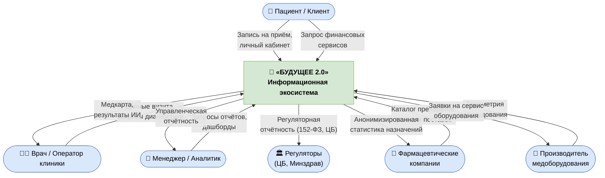
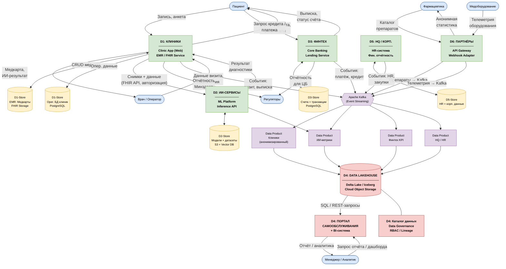
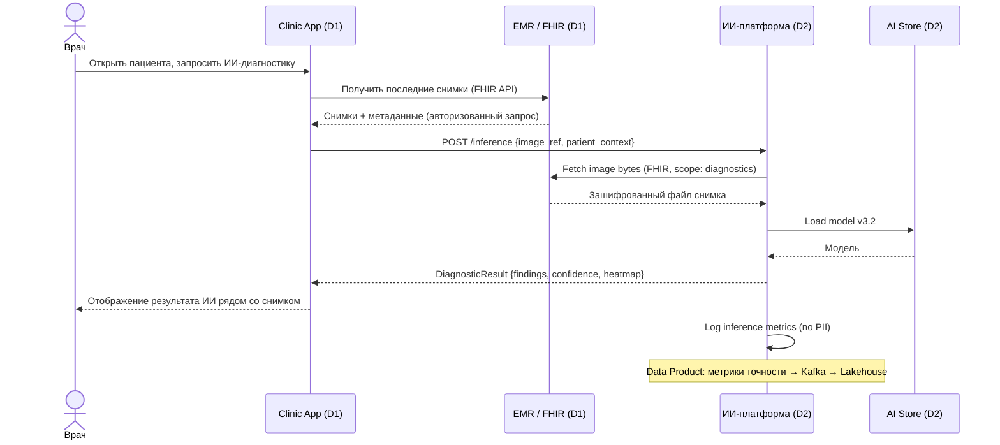
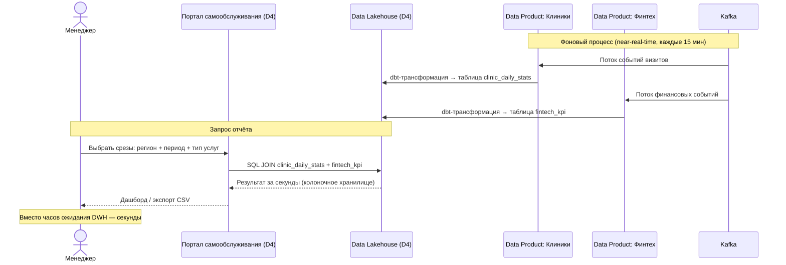
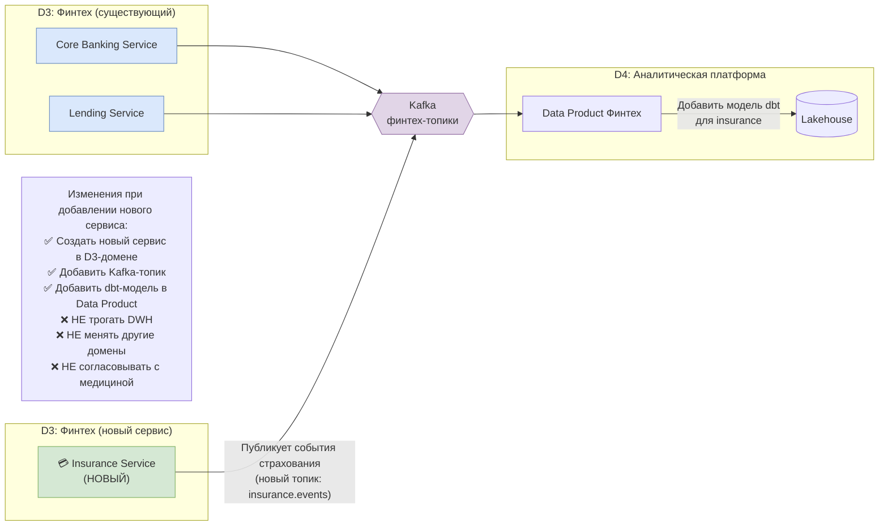
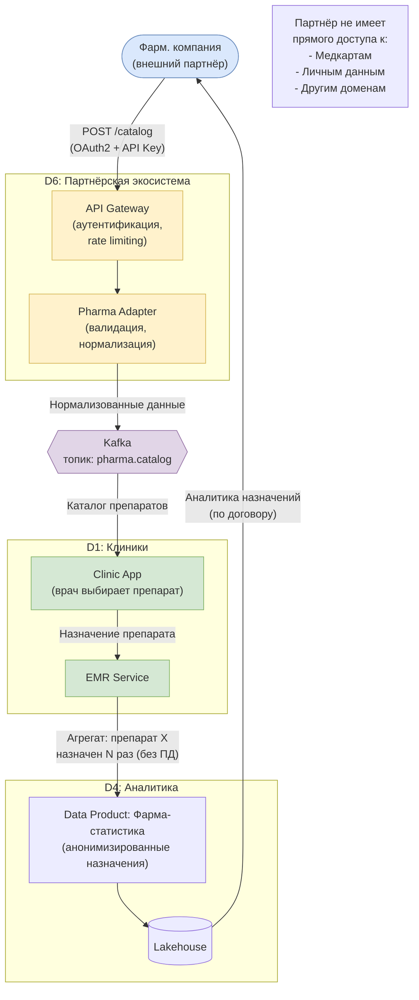

# Задание 2. Разделение на домены и моделирование потоков данных

---

## 1. Карта доменов «Будущее 2.0»

### Принцип разделения

Домены выделены по принципу **Domain-Driven Design**: каждый домен отражает самостоятельную бизнес-способность (Business Capability) с независимым жизненным циклом, командой и данными. Граница домена — это граница ответственности: данные домена принадлежат только ему, внешний доступ — исключительно через опубликованные API или Data Products.

Ключевое правило: **никакой домен не пишет напрямую в DWH другого домена** и не читает из его операционной базы данных. Интеграция — только через события (Kafka) или согласованные API.

---

### Доменная карта

```
┌─────────────────────────────────────────────────────────────────────┐
│                    ЭКОСИСТЕМА «БУДУЩЕЕ 2.0»                         │
│                                                                     │
│  ┌──────────────────┐   ┌──────────────────┐   ┌────────────────┐  │
│  │  D1: КЛИНИКИ     │   │  D2: ИИ-СЕРВИСЫ  │   │  D3: ФИНТЕХ   │  │
│  │  (Медицина)      │   │                  │   │  (Банк)       │  │
│  │                  │◄──┤  - Диагностика   │   │               │  │
│  │  - Пациенты      │   │  - ML Platform   │   │  - Счета      │  │
│  │  - EMR / FHIR    │──►│  - Инференс      │   │  - Кредиты    │  │
│  │  - Расписание    │   │  - Обучение      │   │  - Платежи    │  │
│  │  - Инвентарь     │   │    моделей       │   │               │  │
│  └────────┬─────────┘   └────────┬─────────┘   └──────┬────────┘  │
│           │                      │                     │           │
│           ▼                      ▼                     ▼           │
│  ┌─────────────────────────────────────────────────────────────┐   │
│  │              D4: АНАЛИТИЧЕСКАЯ ПЛАТФОРМА                    │   │
│  │         (Data Lakehouse + Портал самообслуживания)          │   │
│  │                                                             │   │
│  │   [Data Product: Клиники] [Data Product: ИИ] [Data Product: Финтех] │
│  │                  [Data Product: HQ]                         │   │
│  └─────────────────────────────────────────────────────────────┘   │
│           ▲                                                         │
│           │                                                         │
│  ┌────────┴─────────┐   ┌──────────────────────────────────────┐   │
│  │  D5: HQ /        │   │  D6: ПАРТНЁРСКАЯ ЭКОСИСТЕМА          │   │
│  │  КОРП. ФУНКЦИИ   │   │                                      │   │
│  │                  │   │  - Фармацевтика (через API GW)       │   │
│  │  - HR            │   │  - Медоборудование (через Kafka)     │   │
│  │  - Финотчётность │   │                                      │   │
│  │  - Инвентарь     │   └──────────────────────────────────────┘   │
│  └──────────────────┘                                               │
└─────────────────────────────────────────────────────────────────────┘
```

---

### Описание доменов

#### D1 — Клиники (Медицина)

| Атрибут | Значение |
|---|---|
| **Владелец** | Дивизион клиник |
| **Ответственность** | Операционная работа с пациентами: регистрация, визиты, назначения, расписание, инвентарь клиники |
| **Данные домена** | Демографика пациентов, медицинские карты (EMR/FHIR), история визитов, результаты исследований, инвентарь |
| **Данные НЕ в аналитике** | Медицинские карты, история болезней, снимки — остаются только в EMR-сервисе |
| **Data Product** | Анонимизированная статистика: количество визитов, загрузка клиники, финансовые агрегаты |
| **Технологии** | Web App (React), FHIR R4 Service (Java), PostgreSQL |
| **Замещает** | PowerBuilder-интерфейс, часть DWH |

#### D2 — ИИ-сервисы

| Атрибут | Значение |
|---|---|
| **Владелец** | Дочерняя компания ИИ-сервисов |
| **Ответственность** | Обучение и эксплуатация моделей ИИ для медицинской диагностики |
| **Данные домена** | Модели (артефакты), датасеты для обучения, результаты инференса, метрики качества |
| **Входные данные** | Медицинские снимки и данные из D1 (только по явному запросу, через защищённый FHIR API) |
| **Data Product** | Метрики точности моделей, статистика использования, агрегированные результаты |
| **Технологии** | Python / FastAPI, MLflow, Object Storage (S3), Vector DB |
| **Замещает** | ИИ-сервисы через ESB (прямая интеграция заменяет шину) |

#### D3 — Финтех (Банк)

| Атрибут | Значение |
|---|---|
| **Владелец** | Дочерняя финтех-компания с банковской лицензией |
| **Ответственность** | Банковские операции: счета, кредиты, платежи, скоринг |
| **Данные домена** | Счета, транзакции, кредитные договоры, скоринговые данные |
| **Data Product** | Финансовые KPI: объём кредитного портфеля, остатки по счетам, платёжная дисциплина |
| **Регуляторная отчётность** | Отчёты для ЦБ публикует самостоятельно |
| **Технологии** | Golang + Java (микросервисы), PostgreSQL + Redis |
| **Замещает** | Финтех-данные из DWH |

#### D4 — Аналитическая платформа

| Атрибут | Значение |
|---|---|
| **Владелец** | Платформенная команда (Головной офис) |
| **Ответственность** | Сбор Data Products от доменов, предоставление единой аналитической среды |
| **Данные домена** | Агрегированные, анонимизированные Data Products от D1–D3, D5, D6 |
| **НЕ хранит** | Медицинские карты, персональные данные в сыром виде |
| **Сервисы** | Портал самообслуживания, обновлённый Power BI, Data Catalog (Data Governance) |
| **Технологии** | Delta Lake / Iceberg, dbt, Superset, Apache Atlas |
| **Замещает** | Монолитный DWH SQL Server 2008 как аналитическое хранилище |

#### D5 — Головной офис / Корпоративные функции

| Атрибут | Значение |
|---|---|
| **Владелец** | Головной офис |
| **Ответственность** | HR, расчёт зарплат, консолидированная финансовая отчётность, закупки |
| **Данные домена** | Данные сотрудников, структура компании, корпоративные расходы |
| **Data Product** | HR-метрики, консолидированный P&L (без детальных финтех-данных) |
| **Технологии** | SaaS HR + интеграция через API Gateway |

#### D6 — Партнёрская экосистема

| Атрибут | Значение |
|---|---|
| **Владелец** | Платформенная команда / бизнес-развитие |
| **Ответственность** | Безопасная интеграция внешних партнёров (фарма, медоборудование) |
| **Входящие данные** | Каталог препаратов, телеметрия оборудования |
| **Исходящие данные** | Анонимизированная статистика назначений (в пределах договора) |
| **Технологии** | API Gateway (Kong), Kafka (внешние топики), webhook-адаптеры |

---

## 2. Data Flow Diagram (DFD)

### Level 0 — Контекстная диаграмма



---

### Level 1 — Доменная диаграмма потоков данных



---

### Level 2 — Детальные потоки по ключевым бизнес-сценариям

#### Сценарий A: ИИ-диагностика в клинике



**Граница домена**: снимки не копируются в ИИ-хранилище — только ссылка через FHIR. ИИ-домен не хранит персональные медданные.

---

#### Сценарий B: Быстрая управленческая отчётность



---

#### Сценарий C: Подключение нового финтех-сервиса (независимый деплой)



**Было (через DWH)**: 3–6 месяцев — согласование схемы DWH, написание хранимых процедур, тестирование совместимости, риск регрессий.

**Стало (через домен + Kafka)**: 2–4 недели — команда финтеха работает автономно.

---

#### Сценарий D: Интеграция фармацевтического партнёра



---

## 3. Аргументация разделения на домены

### 3.1 Сравнение: монолитный DWH vs. доменная архитектура

| Критерий | DWH-монолит (as-is) | Доменная архитектура (to-be) |
|---|---|---|
| **Добавление нового сервиса** | 3–6 мес. Нужно менять схему DWH, хранимые процедуры, согласовывать с другими командами | 2–4 недели. Команда домена работает автономно, публикует события в Kafka |
| **Деплой финтех-изменений** | Требует тестирования всего DWH — риск сломать отчётность медицины | Финтех деплоит в свой сервис независимо, не затрагивая другие домены |
| **Построение отчёта** | Часы: сложные JOIN-ы по сотням ТБ в общем DWH | Секунды/минуты: преагрегированные Data Products в колоночном Lakehouse |
| **Масштабирование** | Весь DWH масштабируется вертикально (дорого) | Каждый домен масштабируется независимо под свою нагрузку |
| **Отказоустойчивость** | Перегруз от BI-отчётов замедляет работу клиник в реальном времени | Изоляция: нагрузка аналитики не влияет на операционные системы |
| **Регуляторное соответствие** | Медданные, финданные и HR в одной БД — трудно доказать изоляцию | Чёткие границы: EMR изолирован, финтех под регулированием ЦБ отдельно |
| **Найм и развитие команд** | Все изменения через DWH-администратора | Команды финтеха, ИИ и клиник работают со своим стеком |
| **Подключение партнёра** | Прямой доступ к DWH → риск утечки всех данных | Только через API Gateway с явными контрактами на данные |

---

### 3.2 Ключевые преимущества для бизнеса

#### Ускорение вывода продуктов (Time-to-Market)

Независимость доменов позволяет финтех-команде выпускать новые сервисы (страхование, рассрочка, карты) за **2–4 недели вместо 3–6 месяцев**. ИИ-команда может обновлять модели и запускать новые алгоритмы, не ожидая разрешения от DWH-администратора.

Это критично для конкуренции на банковском рынке: финтех-продукты живут в цикле быстрых итераций.

#### Снижение зависимости от DWH

Текущий DWH — единая точка отказа и узкое горлышко. Любое изменение бизнес-логики требует работы с SQL Server 2008 (EoL). В доменной архитектуре:
- Бизнес-логика живёт в сервисах домена (Go, Java, Python)
- Трансформации данных — в dbt-моделях, которые версионируются в Git
- DWH превращается в специализированный аналитический Lakehouse без операционной бизнес-логики

#### Независимое развитие направлений

Каждое из четырёх подразделений компании получает **полный контроль над своим стеком**:
- Клиники выбирают, когда обновлять EMR-систему, без согласования с финтехом
- ИИ-команда экспериментирует с новыми моделями, не затрагивая производство
- Финтех внедряет требования ЦБ в своём домене, не ломая медицинскую отчётность

#### Масштабирование экосистемы

Подключение фармацевтических компаний и производителя медоборудования требует только:
1. Настройки API Gateway (контракт + авторизация)
2. Создания Kafka-топика и адаптера в D6

Новый партнёр **не получает доступа к данным других доменов**. Это критично для репутации: утечка медицинских данных через партнёрскую интеграцию недопустима.

#### Качество медицинских и финансовых сервисов

- Медицинские карты хранятся только в FHIR-сервисе с строгим контролем доступа
- ИИ-сервисы работают с данными через явный, аудируемый API — каждый запрос логируется
- Финансовые данные изолированы в соответствии с требованиями банковской лицензии
- Это снижает риск нарушения **152-ФЗ, требований ЦБ и Минздрава**

---

### 3.3 Граница домена — правила (Domain Contract)

Для каждого домена фиксируются явные соглашения:

```
Домен D1 (Клиники) гарантирует:
  ПУБЛИКУЕТ в Kafka:      clinic.visit.created, clinic.visit.completed
  ПУБЛИКУЕТ в Lakehouse:  clinic_stats (агрегаты, без медкарт)
  ОТДАЁТ через API:       /fhir/Patient/{id} (только авторизованным сервисам D2)
  НЕ ЧИТАЕТ:              базы данных D2, D3, D5 напрямую
  НЕ ПИШЕТ:              в Lakehouse напрямую (только через Data Product pipeline)

Домен D3 (Финтех) гарантирует:
  ПУБЛИКУЕТ в Kafka:      fintech.payment.processed, fintech.loan.issued
  ПУБЛИКУЕТ в Lakehouse:  fintech_kpi (KPI без персональных данных)
  НЕ ЧИТАЕТ:              медицинские карты из D1
  НЕ ЗАВИСИТ:             от доступности D1 или D2 для своей работы
```

Такие контракты позволяют командам работать параллельно и тестировать интеграцию с mock-данными.
