# Задание 3. Технологический радар и роадмап изменений

---

## 1. Технологический радар «Будущее 2.0»

### Методология

Радар построен по формату ThoughtWorks Technology Radar:
- **4 кольца**: Adopt → Trial → Assess → Hold
- **4 квадранта**: Платформы и инфраструктура / Инструменты данных / Языки и фреймворки / Методологии и практики

| Кольцо | Значение |
|---|---|
| **ADOPT** | Применять сейчас. Доказанная ценность, рекомендуется как стандарт |
| **TRIAL** | Внедрить в конкретных проектах. Оцениваем на реальных задачах |
| **ASSESS** | Изучать и наблюдать. Не внедрять в прод без дополнительного исследования |
| **HOLD** | Не начинать новых проектов. Планировать вывод из эксплуатации |

---

### Квадрант 1: Платформы и инфраструктура

```
         ADOPT                    TRIAL                  ASSESS                HOLD
┌─────────────────────┬─────────────────────┬──────────────────────┬──────────────────────┐
│                     │                     │                      │                      │
│  ☁️ Cloud Platform   │  🔑 Keycloak /       │  📊 Vector DB         │  🗄️ SQL Server 2008   │
│  (Azure / AWS)      │  Azure AD B2C       │  (Qdrant / Weaviate) │  ⚠️ EoL, уязвимости, │
│  Масштабирование,   │  Единый IAM для     │  Для RAG в ИИ-сервис.│  часовые отчёты      │
│  cloud-first для    │  всех доменов       │                      │                      │
│  новых бизнесов     │                     │  🌐 Service Mesh      │  🖥️ On-premise        │
│                     │  🔀 Kong API GW      │  (Istio / Linkerd)   │  инфраструктура      │
│  🚀 Apache Kafka     │  Партнёрские        │  Для межсервисного   │  Нет эластичности    │
│  Event Streaming,   │  интеграции,        │  mTLS и observability│                      │
│  замена ESB. Незав. │  rate limiting      │                      │  📡 Apache Camel ESB  │
│  развитие доменов   │                     │                      │  SPOF, монолитная    │
│                     │  🐳 Kubernetes       │                      │  шина, нет isolation │
│  🏔️ Delta Lake /     │  (managed: EKS/AKS) │                      │                      │
│  Apache Iceberg     │  Оркестрация        │                      │                      │
│  Lakehouse-формат,  │  контейнеров по     │                      │                      │
│  быстрая аналитика  │  доменам            │                      │                      │
│                     │                     │                      │                      │
│  🐘 PostgreSQL       │                     │                      │                      │
│  (Cloud managed)    │                     │                      │                      │
│  Операционные БД    │                     │                      │                      │
│  доменов            │                     │                      │                      │
└─────────────────────┴─────────────────────┴──────────────────────┴──────────────────────┘
```

| Технология | Кольцо | Поддерживаемые бизнес-сценарии |
|---|---|---|
| **Cloud Platform (Azure/AWS)** | ADOPT | Масштабирование для фармы/medEquip, снижение CAPEX, disaster recovery |
| **Apache Kafka** | ADOPT | Независимое развитие финтех и ИИ, интеграция партнёров без DWH |
| **Delta Lake / Apache Iceberg** | ADOPT | Быстрая отчётность (секунды вместо часов), единый аналитический слой |
| **PostgreSQL (Cloud managed)** | ADOPT | Операционные БД каждого домена, изоляция данных |
| **Keycloak / Azure AD B2C** | TRIAL | Единый SSO + RBAC для портала самообслуживания, compliance 152-ФЗ |
| **Kong API Gateway** | TRIAL | Безопасная интеграция фармацевтических партнёров |
| **Kubernetes (EKS/AKS)** | TRIAL | Независимый деплой сервисов каждого домена |
| **Vector DB** | ASSESS | Хранение embeddings для ИИ-диагностики (RAG-сценарии) |
| **Service Mesh** | ASSESS | mTLS между сервисами, нужен при росте числа доменных сервисов |
| **SQL Server 2008** | HOLD | Текущий DWH — EoL, часовые отчёты, вся бизнес-логика. Вывести за год |
| **On-premise инфраструктура** | HOLD | Нет эластичности, высокий CAPEX, блокирует подключение новых бизнесов |
| **Apache Camel ESB** | HOLD | SPOF, тесная связность, нет гарантий доставки. Заменяем Kafka |

---

### Квадрант 2: Инструменты данных

```
         ADOPT                    TRIAL                  ASSESS                HOLD
┌─────────────────────┬─────────────────────┬──────────────────────┬──────────────────────┐
│                     │                     │                      │                      │
│  🔧 dbt (data build  │  📂 Apache Atlas /   │  📦 Apache Hudi       │  📊 Power BI          │
│  tool)              │  AWS Glue Catalog   │  Альтернативный      │  (с тяжёлыми         │
│  Трансформации Data │  Data Catalog,      │  Lakehouse-формат    │  кастомизациями      │
│  Products, версиони-│  Lineage, Governance│                      │  поверх DWH)         │
│  рование в Git      │                     │  🔍 DataHub           │  Переподключаем к    │
│                     │  🌊 Apache Airflow / │  Альтернатива Atlas  │  Lakehouse в Trial   │
│  🏄 Apache Superset  │  Prefect            │  (LinkedIn-origin)   │                      │
│  Self-Service Portal│  Оркестрация        │                      │                      │
│  Менеджеры строят   │  Data Product       │  📈 Apache Flink      │                      │
│  отчёты сами        │  пайплайнов         │  Потоковая обработка │                      │
│                     │                     │  (если нужен         │                      │
│  🏥 FHIR R4 (HL7)   │  🔍 Great             │  real-time аналитика)│                      │
│  Стандарт медданных │  Expectations /     │                      │                      │
│  Изоляция EMR,      │  Soda Core          │                      │                      │
│  compliance         │  Data Quality       │                      │                      │
│                     │  тесты              │                      │                      │
│  🧪 MLflow           │                     │                      │                      │
│  ML lifecycle: трек-│  📊 Power BI         │                      │                      │
│  кинг, реестр моде- │  (обновлённый,      │                      │                      │
│  лей, воспроизводи- │  из Lakehouse)      │                      │                      │
│  мость экспериментов│                     │                      │                      │
└─────────────────────┴─────────────────────┴──────────────────────┴──────────────────────┘
```

| Технология | Кольцо | Поддерживаемые бизнес-сценарии |
|---|---|---|
| **dbt** | ADOPT | Версионируемые трансформации Data Products, тестируемость, Git-flow |
| **Apache Superset** | ADOPT | Портал самообслуживания — ключевое бизнес-требование руководства |
| **FHIR R4 (HL7)** | ADOPT | Изоляция медкарт, compliance Минздрав, интеграция медоборудования |
| **MLflow** | ADOPT | Воспроизводимость ИИ-экспериментов, версионирование моделей |
| **Apache Atlas / AWS Glue** | TRIAL | Data Governance — требование ЦБ и 152-ФЗ |
| **Apache Airflow / Prefect** | TRIAL | Оркестрация пайплайнов Data Products по доменам |
| **Great Expectations / Soda** | TRIAL | Качество данных в Lakehouse — доверие к отчётам |
| **Power BI (из Lakehouse)** | TRIAL | Переходный этап: переключить существующий BI с DWH на Lakehouse |
| **Apache Flink** | ASSESS | Real-time аналитика (актуально если потребуется стриминговая отчётность) |
| **Power BI (с кастомизациями из DWH)** | HOLD | Кастомизации завязаны на DWH-схему. Переносим в Superset + dbt |

---

### Квадрант 3: Языки и фреймворки

```
         ADOPT                    TRIAL                  ASSESS                HOLD
┌─────────────────────┬─────────────────────┬──────────────────────┬──────────────────────┐
│                     │                     │                      │                      │
│  🐍 Python 3.11+    │  ⚛️ React / Next.js  │  🦀 Rust              │  🖥️ PowerBuilder      │
│  ИИ-сервисы,        │  Замена PowerBuilder │  Высоконагруженные   │  Клиентский интерфей-│
│  Data Engineering   │  (Clinic App)       │  компоненты (если    │  с клиник. Нет       │
│                     │                     │  потребуется)        │  разработчиков,      │
│  🐹 Golang          │  🔥 FastAPI           │                      │  нет мобильности     │
│  Финтех-микросервисы│  Python HTTP API     │  📱 React Native      │                      │
│  (уже в prod)       │  для ИИ-инференса   │  Мобильное приложение│  🏛️ PL/SQL            │
│                     │                     │  для пациентов и     │  Хранимые процедуры  │
│  ☕ Java 17+         │  🔄 Pydantic v2      │  врачей              │  в DWH — бизнес-логи-│
│  Финтех и FHIR-     │  Валидация данных   │                      │  ка вне контроля     │
│  сервисы (уже в     │  между доменами     │                      │  версий              │
│  prod)              │                     │                      │                      │
│                     │  🌿 Spring Boot 3    │                      │                      │
│  🐋 Docker           │  Стандарт для Java- │                      │                      │
│  Контейнеризация    │  сервисов           │                      │                      │
│  всех новых сервисов│                     │                      │                      │
└─────────────────────┴─────────────────────┴──────────────────────┴──────────────────────┘
```

| Технология | Кольцо | Поддерживаемые бизнес-сценарии |
|---|---|---|
| **Python 3.11+** | ADOPT | ИИ-диагностика, Data Engineering пайплайны |
| **Golang** | ADOPT | Финтех-микросервисы (уже в prod, сохраняем) |
| **Java 17+** | ADOPT | FHIR-сервис, финтех (уже в prod, сохраняем) |
| **Docker** | ADOPT | Изолированный деплой сервисов каждого домена |
| **React / Next.js** | TRIAL | Замена PowerBuilder — Web App для операторов клиник |
| **FastAPI** | TRIAL | HTTP API для ИИ-инференса (быстрее Flask, автодокументация) |
| **React Native** | ASSESS | Мобильный доступ для врачей и пациентов (после Web-версии) |
| **PowerBuilder** | HOLD | Технология 1990-х. Нет разработчиков, нет мобильности, нет интеграций |
| **PL/SQL (хранимые процедуры)** | HOLD | Бизнес-логика в БД — вне контроля версий, нетестируема |

---

### Квадрант 4: Методологии и практики

```
         ADOPT                    TRIAL                  ASSESS                HOLD
┌─────────────────────┬─────────────────────┬──────────────────────┬──────────────────────┐
│                     │                     │                      │                      │
│  🧩 Domain-Driven    │  📦 Data Contract    │  🔐 Zero Trust        │  🏗️ Монолитный DWH   │
│  Design (DDD)       │  (Atanas / Schemata)│  Network Model       │  как единая точка    │
│  Основа разделения  │  Явные соглашения   │                      │  всей бизнес-логики  │
│  на домены          │  между доменами     │  🌐 GitOps            │                      │
│                     │                     │  (ArgoCD / Flux)     │  🔄 Ручные ETL-       │
│  🌐 Data Mesh        │  🧪 TDD / BDD        │  Декларативный деплой│  трансформации       │
│  Data-as-a-Product, │  для domain-сервисов│                      │  в DWH               │
│  federated          │                     │  🧬 Feature Flags     │                      │
│  governance         │  🔍 Observability    │  Постепенный выкат   │                      │
│                     │  (OpenTelemetry +   │  новых функций       │                      │
│  🔁 Event-Driven     │  Grafana)           │                      │                      │
│  Architecture       │  Единый мониторинг  │                      │                      │
│  Kafka как основа   │  всех доменов       │                      │                      │
│  интеграции         │                     │                      │                      │
│                     │  🛡️ GDPR / 152-ФЗ   │                      │                      │
│  ☁️ Cloud-First      │  Data Privacy by    │                      │                      │
│  Новые проекты —    │  Design в каждом    │                      │                      │
│  только в облаке    │  домене             │                      │                      │
│                     │                     │                      │                      │
│  🔄 CI/CD (GitLab/  │                     │                      │                      │
│  GitHub Actions)    │                     │                      │                      │
│  Автоматизация      │                     │                      │                      │
│  деплоя доменов     │                     │                      │                      │
└─────────────────────┴─────────────────────┴──────────────────────┴──────────────────────┘
```

| Методология | Кольцо | Поддерживаемые бизнес-сценарии |
|---|---|---|
| **Domain-Driven Design** | ADOPT | Основа независимого развития финтех, ИИ, клиник |
| **Data Mesh** | ADOPT | Интеграция фармы/medEquip без изменений DWH |
| **Event-Driven Architecture** | ADOPT | Слабая связность доменов, масштабирование |
| **Cloud-First** | ADOPT | Масштабирование ресурсов под нагрузку, подключение новых бизнесов |
| **CI/CD** | ADOPT | Быстрый time-to-market финтех и ИИ, автономные деплои доменов |
| **Data Contract** | TRIAL | Явные соглашения между доменами — предсказуемость интеграций |
| **Observability (OpenTelemetry)** | TRIAL | Мониторинг SLA медицинских и финансовых сервисов |
| **GDPR / 152-ФЗ Privacy by Design** | TRIAL | Compliance в каждом домене, не как надстройка |
| **Zero Trust** | ASSESS | Нужен при масштабировании числа партнёров |
| **Монолитный DWH как центр логики** | HOLD | Антипаттерн. Любая бизнес-логика в DWH — технический долг |
| **Ручные ETL в DWH** | HOLD | Нетестируемые, непрозрачные трансформации без версионирования |

---

## 2. Роадмап изменений (12 месяцев)

### Общая схема роадмапа

```
МЕСЯЦ:     1         2         3         4         5         6         7         8         9        10        11        12
           ├─────────┼─────────┼─────────┼─────────┼─────────┼─────────┼─────────┼─────────┼─────────┼─────────┼─────────┤
           │         ЭТАП 1: ФУНДАМЕНТ                       │ ЭТАП 2: ПРОДУКТ                        │ ЭТАП 3: МАСШТАБ  │
           │   (Архитектура + Cloud + Безопасность)          │   (Data Products + Портал)             │   (Партнёры + UX)│

ПЛАТФОРМА  ├──[Cloud setup: VPC, IAM, Kafka, Lakehouse MVP]──┼──[Lakehouse PROD, dbt pipelines]───────┼──[Partner API GW]┤
ДАННЫЕ     ├──[EMR изоляция: FHIR-сервис]────────────────────┼──[Data Products: Клиники + Финтех]─────┼──[DP: HQ + ИИ]───┤
АНАЛИТИКА  ├──[Power BI → Lakehouse (пилот)]─────────────────┼──[Superset MVP]────────────────────────┼──[Портал PROD]───┤
ФИНТЕХ     ├──[Домен: граница + Kafka-топики]────────────────┼──[Новые сервисы независимо]────────────┼──[ESB выведен]───┤
ИИ         ├──[Домен: изоляция хранилища]────────────────────┼──[MLflow, независимый деплой]──────────┼──[DP: метрики]───┤
КЛИНИКИ    ├──[PowerBuilder аудит + план миграции]───────────┼──[Clinic Web App: пилот]───────────────┼──[Clinic App PROD│
```

---

### Этап 1. Фундамент (Месяцы 1–3)

**Бизнес-цель:** Устранить критические риски, заложить архитектурную основу. Без этого этапа невозможен ни один последующий.

```mermaid
gantt
    title Этап 1 — Фундамент (мес. 1-3)
    dateFormat MM
    axisFormat %m

    section Платформа
    Cloud: VPC, сети, IAM-базис         :01, 3w
    Apache Kafka: кластер + топики      :01, 5w
    Data Lakehouse MVP (Delta Lake)      :02, 6w

    section Безопасность / Compliance
    EMR-сервис: FHIR R4, изоляция медданных :01, 8w
    Keycloak / Azure AD: единый SSO         :02, 4w
    Политики RBAC по доменам                :03, 2w

    section Домены (границы)
    Документирование Domain Contracts    :01, 2w
    Финтех: переключение на Kafka-топики :02, 4w
    ИИ: изоляция хранилища (S3 + MLflow) :02, 4w

    section Аналитика (переход)
    Power BI → Lakehouse: пилот (1 отчёт) :03, 2w
    dbt: первые модели (DDL клиники)      :03, 2w
```

#### Проекты этапа 1

| Проект | Ответственная команда | Ресурсы | Ожидаемый результат |
|---|---|---|---|
| **Cloud Foundation** | Платформенная команда | 2 Cloud Architect, 1 DevOps, 1 мес. | VPC, сети, IAM, Kafka-кластер в облаке |
| **EMR Isolation** | Команда клиник + платформа | 2 Backend (Java), 1 BA, 2 мес. | FHIR R4 сервис; медкарты изолированы от DWH |
| **Domain Contracts** | Архитекторы + техлиды всех доменов | 2 Architect, 3 недели | Задокументированы события Kafka и API-контракты |
| **Fintech → Kafka** | Финтех-команда | 2 Backend (Go), 1 мес. | Финтех публикует события в Kafka, ESB не задействован |
| **AI Storage Isolation** | ИИ-команда | 1 MLOps + 2 ML Engineer, 1 мес. | S3-хранилище, MLflow — независимо от DWH |
| **Lakehouse MVP** | Платформенная команда | 2 Data Engineer, 1.5 мес. | Работающий Delta Lake в облаке, первые сырые данные |

**Бизнес-обоснование этапа 1:**
- EMR-изоляция устраняет юридический риск нарушения 152-ФЗ — без этого возможна потеря медицинской лицензии
- Kafka убирает ESB как SPOF — любой сбой шины сейчас останавливает все операции
- Cloud Foundation — технический пре-реквизит для масштабирования под фармацевтических партнёров

**KPI этапа:** Медицинские карты изолированы и недоступны из общего DWH. Kafka принимает события от финтеха. Lakehouse хранит первые данные.

---

### Этап 2. Продукт (Месяцы 4–6)

**Бизнес-цель:** Запустить портал самообслуживания (MVP), перевести первые домены на Data Products, обеспечить независимый деплой финтеха и ИИ.

```mermaid
gantt
    title Этап 2 — Продукт (мес. 4-6)
    dateFormat MM
    axisFormat %m

    section Data Products
    Data Product: Клиники (dbt + Spark)    :04, 6w
    Data Product: Финтех (dbt)             :04, 5w

    section Портал самообслуживания
    Apache Superset: развёртывание         :04, 2w
    Подключение к Lakehouse                :04, 2w
    RBAC: роли и уровни доступа            :05, 2w
    Обучение бизнес-пользователей          :06, 2w
    Superset MVP: первые дашборды          :06, 2w

    section BI-система
    Power BI: переключение на Lakehouse    :04, 4w
    Вывод прямой связи Power BI ↔ DWH     :06, 2w

    section Независимость доменов
    Финтех: первый новый сервис без DWH    :05, 4w
    ИИ: MLflow CI/CD pipeline             :04, 3w
    ИИ: независимый деплой новой модели   :05, 3w

    section Качество данных
    Great Expectations: базовые тесты      :05, 3w
```



#### Проекты этапа 2

| Проект | Ответственная команда | Ресурсы | Ожидаемый результат |
|---|---|---|---|
| **Data Product: Клиники** | Data-команда клиник | 2 Data Engineer, dbt, 6 нед. | Анонимизированные агрегаты клиник в Lakehouse |
| **Data Product: Финтех** | Data-команда финтеха | 1 Data Engineer, dbt, 5 нед. | Финансовые KPI в Lakehouse |
| **Superset MVP** | Платформенная команда | 1 Frontend, 1 Data Analyst, 1 мес. | Менеджеры строят отчёты самостоятельно |
| **RBAC для Портала** | Платформа + Security | 1 Security Arch., 1 DevOps, 2 нед. | Доступ строго по ролям и доменам |
| **Power BI → Lakehouse** | Аналитическая команда | 2 BI Analyst, 1 мес. | Power BI читает из Lakehouse, не из SQL Server |
| **Финтех: новый сервис без DWH** | Финтех-команда | 2 Backend (Go), 1 мес. | Доказательство независимости домена |
| **MLflow CI/CD** | ИИ-команда | 1 MLOps Engineer, 3 нед. | Автоматизированный деплой моделей |
| **Data Quality (Great Expectations)** | Платформенная команда | 1 Data Engineer, 3 нед. | Автоматические тесты качества Data Products |

**Бизнес-обоснование этапа 2:**
- Портал самообслуживания — прямое требование руководства. Менеджеры перестают ждать IT для каждого нового отчёта
- Data Products заменяют прямые запросы в DWH: отчёты строятся за секунды, а не часы
- Независимый деплой финтеха: time-to-market нового финтех-продукта — недели, а не месяцы

**KPI этапа:** Первый дашборд в Superset. Power BI работает из Lakehouse. Финтех задеплоил один новый сервис без изменений DWH. ИИ-команда выкатила обновление модели автономно.

---

### Этап 3. Масштаб и качество (Месяцы 7–12)

**Бизнес-цель:** Полнофункциональный портал, вывод legacy-систем, подключение партнёров, Data Governance для compliance, замена PowerBuilder.

```mermaid
gantt
    title Этап 3 — Масштаб (мес. 7-12)
    dateFormat MM
    axisFormat %m

    section Вывод Legacy
    ESB (Apache Camel): вывод из прода   :07, 4w
    DWH SQL Server: перевод в read-only  :08, 6w
    DWH SQL Server: вывод из эксплуатации :11, 4w

    section Data Governance
    Apache Atlas: Data Catalog           :07, 6w
    Data Lineage: настройка              :08, 4w
    RBAC audit + отчёт для регуляторов  :10, 3w

    section Партнёрская экосистема
    API Gateway (Kong): настройка        :07, 4w
    Pharma: пилотная интеграция          :08, 4w
    MedEquip: Kafka-топик телеметрии     :09, 4w

    section Портал (полная версия)
    Superset: конструктор отчётов        :07, 4w
    Уведомления и алерты                 :08, 3w
    Мобильная адаптация                  :09, 4w
    Self-Service: полный выкат           :10, 2w

    section Клиники (UX)
    Clinic Web App: пилот (1 клиника)   :07, 6w
    Clinic Web App: масштабирование      :10, 6w
    PowerBuilder: вывод                 :12, 2w

    section Data Products (HQ + ИИ)
    Data Product: HQ / HR               :07, 4w
    Data Product: ИИ-метрики            :08, 4w
    Консолидированная отчётность HQ     :09, 4w
```



#### Проекты этапа 3

| Проект | Ответственная команда | Ресурсы | Ожидаемый результат |
|---|---|---|---|
| **Вывод ESB** | Платформенная команда | 2 DevOps, 1 мес. | ESB отключён, все интеграции — через Kafka |
| **DWH вывод из прода** | Платформа + все домены | 2 Arch., 3 мес. (параллельно) | SQL Server 2008 только архивный read-only, затем полный вывод |
| **Apache Atlas (Data Catalog)** | Платформенная команда | 2 Data Engineer, 1.5 мес. | Lineage всех Data Products, реестр метаданных |
| **Partner API Gateway** | Платформа + бизнес-развитие | 2 Backend, 1 BA, 1.5 мес. | Фарм-партнёры подключены через Kong, телеметрия medEquip в Kafka |
| **Superset: полный функционал** | Платформа + Product | 1 Frontend, 1 Data Analyst, 2 мес. | Конструктор отчётов, алерты, экспорт |
| **Clinic Web App** | Команда клиник | 3 Frontend (React), 2 Backend, 3 мес. | Замена PowerBuilder, web-интерфейс для врачей |
| **Data Product: HQ + ИИ** | Data-команды HQ и ИИ | 2 Data Engineer, по 1 мес. | Консолидированный P&L и ИИ-метрики в Lakehouse |
| **Регуляторный отчёт (RBAC audit)** | Security + Compliance | 1 Security Arch., 3 нед. | Доказательство изоляции данных для Минздрава и ЦБ |
| **Вывод PowerBuilder** | Команда клиник | 1 PM, 1 DevOps, 2 нед. | PowerBuilder деактивирован |

**Бизнес-обоснование этапа 3:**
- Вывод SQL Server 2008 — избавление от EoL-системы без патчей безопасности (риск аудита)
- Data Catalog закрывает требование ЦБ к прослеживаемости финансовых данных
- Партнёрская экосистема открывает новый канал выручки (фармацевтика, medEquip)

**KPI этапа:** ESB выведен. DWH в read-only. Портал самообслуживания полностью заменяет BI-очередь к IT. Два фармацевтических партнёра подключены. PowerBuilder выведен.

---

## 3. Сводная таблица роадмапа

| Этап | Период | Ключевые проекты | Ответственные команды | Ресурсы (FTE) | Бизнес-результат |
|---|---|---|---|---|---|
| **1. Фундамент** | Мес. 1–3 | Cloud, Kafka, EMR/FHIR, изоляция доменов | Платформа, Клиники, Финтех, ИИ | 12–14 FTE | Устранены критические риски (152-ФЗ, EoL DWH). Kafka заменяет ESB в финтехе |
| **2. Продукт** | Мес. 4–6 | Data Products (Клиники+Финтех), Superset MVP, Lakehouse PROD | Платформа, все домены | 10–12 FTE | Портал самообслуживания запущен. Первые отчёты за секунды. Финтех деплоит независимо |
| **3. Масштаб** | Мес. 7–12 | Вывод DWH/ESB, Governance, Partner API, Clinic Web App | Все команды | 14–16 FTE | SQL Server 2008 выведен. Два партнёра подключены. PowerBuilder заменён |

---

## 4. Обоснование изменений с точки зрения бизнеса

### 4.1 Влияние на скорость принятия решений

| Было (DWH) | Стало (Lakehouse + Superset) | Разница |
|---|---|---|
| Сложный отчёт: 2–8 часов | Тот же отчёт: 5–30 секунд | **×100–1000 быстрее** |
| Новый срез данных: задача в IT-очередь (3–10 дней) | Менеджер строит срез сам в Superset | **Мгновенно** |
| Отчёт для ЦБ: подготовка 2–3 дня | Data Product финтеха → готовый отчёт | **2–4 часа** |

Каждый час задержки управленческого решения в финтехе — это потенциально упущенная сделка, одобренный кредит конкурента, несвоевременная реакция на fraud.

### 4.2 Влияние на качество медицинских и финансовых сервисов

**Медицина:**
- FHIR-сервис с изолированным хранилищем исключает случайный доступ к медкартам через SQL-запросы
- ИИ-диагностика работает через явный, аудируемый API с авторизацией — каждый запрос к снимку логируется
- Clinic Web App (замена PowerBuilder) даёт врачам современный UX с поиском, фильтрацией и интеграцией с ИИ прямо в интерфейсе

**Финансы:**
- Изолированная финансовая БД финтеха исключает влияние нагрузки от медицинских запросов
- Data Catalog с Lineage позволяет объяснить происхождение любой цифры в отчёте для ЦБ
- Kafka-события с гарантиями доставки (at-least-once) не теряют платёжные транзакции при сбое ESB

### 4.3 Влияние на снижение затрат

| Статья затрат | Было | Стало | Экономия |
|---|---|---|---|
| **CAPEX на железо** | Закупка серверов при росте (месяцы) | Cloud auto-scaling (минуты) | Нет заморозки капитала в железе |
| **Поддержка SQL Server 2008** | Платная расширенная поддержка EoL | Managed cloud DB (PostgreSQL) | Вывод из эксплуатации = экономия ~$50–200k/год |
| **Разработчики PowerBuilder** | Дефицитные и дорогие специалисты | React-разработчики (рынок) | Снижение стоимости найма и удержания |
| **Время аналитиков** | Очередь BI-запросов к IT | Self-service | Экономия ~40% времени IT-аналитиков на рутину |
| **Интеграция нового бизнеса** | 3–6 мес. разработки в DWH | 2–4 нед. нового домена + Kafka | Экономия dev-месяцев при каждом новом партнёре |

### 4.4 Влияние на масштабирование

**Горизонт 12 месяцев (роадмап):**
Подключение фармацевтических партнёров и производителя medEquip — через API Gateway без изменений в существующих доменах. Новый партнёр получает ровно те данные, на которые есть контракт.

**Горизонт 2–3 лет (за рамками роадмапа):**
Архитектура Data Mesh позволяет добавить новый бизнес (например, телемедицину или страхование) как отдельный домен D7. Единственные изменения:
1. Создать инфраструктуру домена в облаке (1–2 недели, IaC-шаблоны)
2. Зарегистрировать Kafka-топики в каталоге (1 день)
3. Написать dbt-модель для Data Product (1–2 недели)
4. Подключить к Порталу самообслуживания (настройка, не разработка)

Существующие домены при этом не трогаются. **Масштабирование бизнеса перестаёт быть ограничено IT-архитектурой.**

---

### 4.5 Риски роадмапа и меры снижения

| Риск | Вероятность | Влияние | Мера снижения |
|---|---|---|---|
| Задержка Cloud Foundation (бюрократия, контракты) | Средняя | Высокое | Начать с PoC-среды параллельно с тендером |
| Сопротивление пользователей (PowerBuilder → Web App) | Высокая | Среднее | Пилот в 1 клинике, UX-исследование до разработки |
| Потеря данных при миграции из DWH | Низкая | Критическое | DWH остаётся read-only 6 мес. после Lakehouse PROD |
| Нехватка Data Engineers для dbt | Средняя | Высокое | Обучение текущих аналитиков + 2 внешних специалиста |
| Регуляторный риск (ЦБ не принимает новый формат отчётности) | Средняя | Высокое | Ранний диалог с регулятором, параллельная подача старого формата |
| Kafka-экспертиза отсутствует в команде | Средняя | Среднее | Kafka managed (Confluent Cloud), внешний архитектор на 2 мес. |
